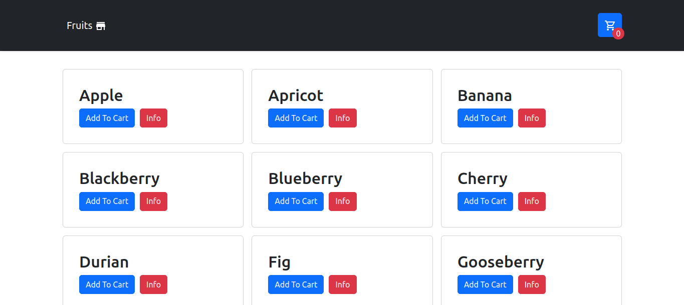

# Fruit

O Desafio está 100% feito. Tive um imprevisto com a api, que estava dando erro de cors e não aceitava minhas requisições, mas consegui burlar isso usando uma proxy. Mas se der erro quando for tentar rodar, é só tirar o "proxy" do package.json e colocar o link no axios da page Store, que está em src/pages/Store.tsx. 

## Em caso de Erro

Nessa função:

```
async function loadData(){
	 await axios.get('/api/fruit/all')
       .then(res => setFrutas(res.data));
}
```

Ai você troca pra isso depois de tirar o "proxy" de package.json:

```
async function loadData(){
    await axios.get('https://fruityvice.com/api/fruit/all')
        .then(res => setFrutas(res.data));
}
```

## Stack
- React
- TypeScript
- Rotas customizadas com o react-router-dom
- Material-ui

## Screenshots

